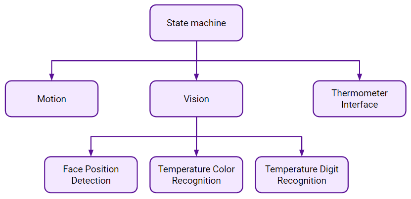

# Covid Commando Project 
### Authors: Anuj Karnik, Christopher Tsai, Di Wu, Tomasz Trzpit 


## Overview 
The Covid Commando is a Baxter robot that takes a person's temperature and indicates if the individual has normal or high temperature. We showcased its use by having it screen individuals that wish to enter the Center of Robotics and Biosystems at Northwestern, where the Baxter robot resides. The robot accomplishes the following tasks: 1) detects the location of a person's forehead, 2) moves the IR thermometer to in front that location, 3) takes the temperature, 4) displays the temperature and corresponding message on screen, 5) blocks or allows the person to pass, and 6) finally returns to the first state. 

## System Architecture 


### State Machine 
The state machine is the main controller that launches the program and determines robot actions for its current state. <br>
[More info on state machine package](state_machine/README.md) <br>

### Facial Detection and Temperature Reading
The vision package handles facial detection, pose esimtation, and temperature reading. <br>
[More info on vision package](vision/README.md)<br>

### Motion Planning 
The motion package handles all Baxter robot arm controls.<br>
[More info on motion package](motion/README.md) <br>


### Thermometer Interface
The thermometer was activated by an Arduino through a wired connection to its switch. The Arduino triggers temperature reading when the Baxter arm lights are turned on.<br>
[More info on thermometer interface](hardware_io/README.md)


## Startup Guide 
1. Create a workspace <br>
   `mkdir -p ws/src`
2. Clone this repo into the src folder
3. `catkin make` in the ws folder
4. `source devel/setup.bash` in the ws folder
5. Connect to Baxter robot 
6. `roslaunch state_machine state_machine.launch` 

## Nodes and Launchfiles 
Nodes:
- State Machine 
  - [state_machine_node](state_machine/nodes/state_machine_node)
- Vision
  - [face_detection](vision/nodes/face_detection)
  - [read_digit](vision/nodes/read_digit) 
  - [read_temperature](vision/nodes/read_temperature)
- Motion Planning 
  - [mover](motion/nodes/mover)

Launchfiles:
- State Machine 
  - [state_machine.launch](state_machine/launch/state_machine.launch)
- Vision
  - [face_detection.launch](vision/launch/face_detection.launch)
  - [temperature_detection.launch](vision/launch/temperature_detection.launch)
- Motion Planning 
  - [mover.launch](motion/launch/mover.launch)

## Complete File Layout
```
├── CMakeLists.txt
├── hardware_io
│   └── thermometer_controller.ino - Arduino code for thermometer circuit
├── motion
│   ├── CMakeLists.txt
│   ├── config
│   │   └── coordinates.yaml
│   ├── launch
│   │   └── mover.launch - contains everything for moving arm to different poses
│   ├── nodes
│   │   └── mover - provides services for motion planning
│   ├── package.xml
│   └── srv
│       ├── GetPose.srv - acquires current pose data 
│       └── GoToPose.srv - plans and executes trajectory to specified pose
├── README.md
├── state_machine
│   ├── CMakeLists.txt
│   ├── images
│   │   ├── face_found.png
│   │   ├── move_to_face.png
│   │   ├── search_for_face.png
│   │   ├── take_temperature.png
│   │   ├── temp_high.png
│   │   ├── temp_normal.png
│   │   └── temp.png
│   ├── launch
│   │   └── state_machine.launch - main launchfile for control loop that switches between states
│   ├── nodes
│   │   └── state_machine_node - communicates with all other nodes and calls services for different tasks
│   ├── package.xml
│   ├── README.md
│   ├── src
│   │   └── state_machine
│   │       ├── displays.py
│   │       └── __init__.py
│   └── srv
│       └── SetState.srv - service for switching to specified state
└── vision
    ├── CMakeLists.txt
    ├── config
    │   ├── face_detection.rviz
    │   └── thermometer_calibration.yaml
    ├── launch
    │   ├── face_detection.launch - contains face_detection node and realsense camera interface
    │   └── temperature_detection.launch - launches nodes for temperature reading
    ├── nodes
    │   ├── face_detection - detects face and sends pose estimate of person's forehead
    │   ├── read_digit - detects specific temperature digits 
    │   └── read_temperature - detects whether temperature is normal or high
    ├── package.xml
    └── README.md 
```

## Videos 
- Final demo: https://www.youtube.com/watch?v=Jk9b8oqRLSs&t=52s
- Demos of other stages of the project can be found in the Covid Commando YouTube channel: \
https://www.youtube.com/channel/UCiMYOwYpeRzvlzgUHT3ue5A

## Miscellaneous
[Sphinx documentation for display python package](state_machine/src/state_machine/build/html/index.html)
