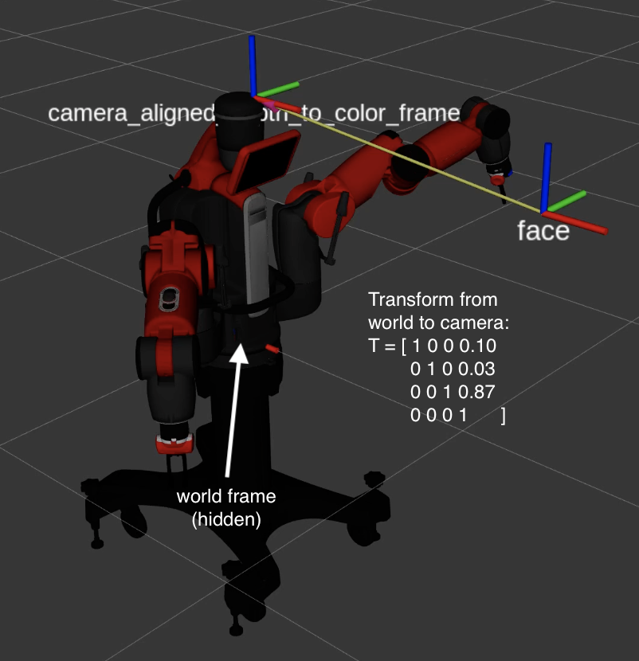

# Vision Package 

## Overview 
The vision package handles all Baxter vision tasks, which include facial detection, pose estimation, and temperature reading.

## Nodes
- `face_detection`: Uses RealSense RGB-D lenses' data to detect a person's face and, once the person stands still, estimate their forehead's 3D pose in space.
- `read_temperature`: Uses an image from Baxter hand camera feed to identify whether the IR thermometer has shown a green (safe temperature) result or red (unsafe temperature) result on the LED screen
- `read_digit`: Reads an image frame from a ROS image_raw message, allows the user to highlight a region of interest (capture window), then attempts to read a 7-segment LED display using image segmentation.
  
## Launchfiles
- `face_detection.launch`: Launches `face_detection` node, `rs_camera.launch` (ROS's interface with the RealSense), and RViz.
- `temperature_detection.launch`: Launches `read_temperature` and `read_digit` nodes from this package as well as `camera_control`, a Baxter node that is used to configure the right arm camera.

## Usage for vision package only
To launch: <br/>
```Shell
roslaunch vision face_detection.launch
roslaunch vision temperature_detection.launch
```

## Camera Calibration (Extrinsic)
The `config/camera_calibration.yaml` file contains the physically measured translation components of Twr, the pose of the RealSense RGB camera's frame in the Baxter world frame.
<br>
<br>


## Thermometer Calibration
The `config/thermometer_calibration.yaml` file contains pixel values for the rectangular area that is considered when detecting temperature level (green/red) and value (digits). These values must be edited every time the thermometer gun is mounted to the robot.

## Face Detection pseudocode
```
1. Initialize CvBridge
2. Subscribe to aligned_depth_to_color/image_raw
3. Use CvBridge to convert ROS image message to CV2 image 
4. Prepare image (convert using CV2, BGR to GRAYSCALE)
5. Use CV2 face cascade classifier to detect face
6. If face found:
7.   Publish “True” to face_found topic
7.   Attempt to “lock” on the face
9.   If average face centroid < threshold over 10 frames:
10.    Pass face centroid x,y into depth transform
```

## Pose Estimation pseudocode
```
1. While faces are detected:
2.   If detected face is stationary (person stands still):
3.     Initialize forehead x,y
4.     Acquire depth data corresponding to this pixel
5.     Project forehead x,y to a 3D ray (unit vector that 
       goes thru pixel)
6.     Initialize Trf using depth * unit vector
7.     If depth < 4 m:
8.       Send Trf
9.       Read Twf from tf topic
10.      Publish Twf pose so state machine can read and send
         to mover node
```

## Temperature Level Recognition pseudocode
```
1. Subscribe to wrist camera image
2. Use CvBridge to convert ROS image message to CV2 image 
3. Create region of interest
4. Find average R, G, B values over region of interest
5. If G > threshold:
6.   Publish “GREEN” to temperature_reading topic 
7. If R > threshold:
8.   Publish “RED” to temperature_reading topic 
9. Else: 
10.  Publish “CLEAR” to temperature_reading topic
```

## Temperature Value Recognition pseudocode
```
1. Create region of interest
2. Rotate and correct image through thresholding 
3. Segment image into 7-segment LED pattern
4. For segment i in 1 to 7:
5.   Find average of each segment
6.   If segment average > threshold:
7.     Segment_average[i] = true
8. Compare segment_average with truth table:
9. Publish temperature to digit_pub topic
```


